<h1 align="center">Anbudan Amma <sub>அன்புடன் அம்மா</sub></h1>

<p align="center"><b>"With love, Amma." A caring Amma for your phone that asks: have you eaten?</b><br>
Gentle reminders in Tamil, Tanglish or English, from a cartoon mother who worries about you.</p>

<p align="center">
  <a href="../../actions/workflows/test.yml"></a>
  
  
  
  <a href="LICENSE"></a>
</p>

<p align="center">
  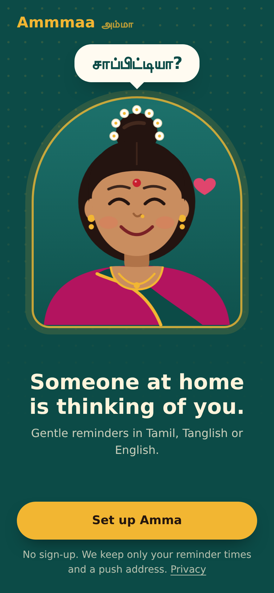
  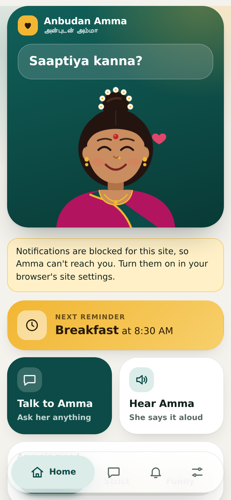
  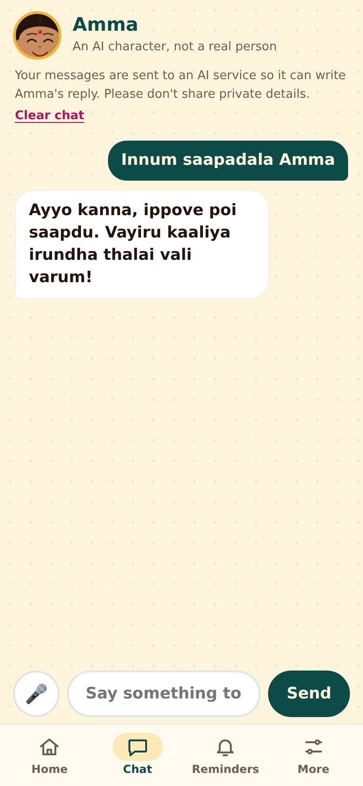
  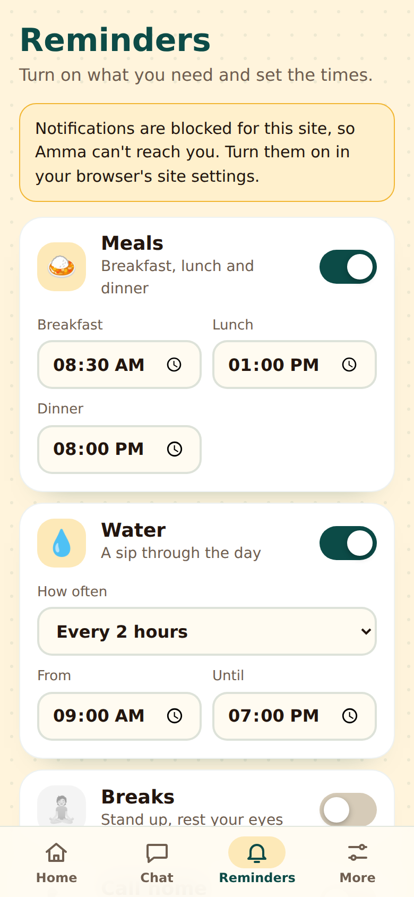
  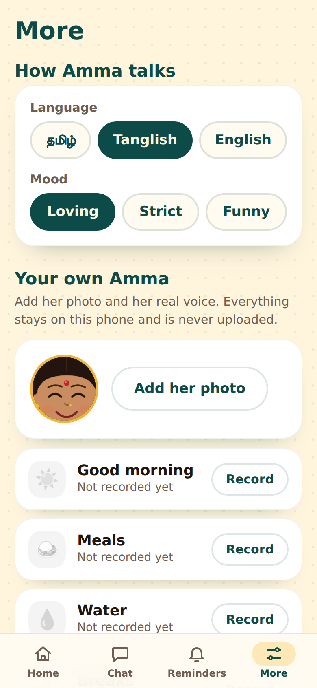
</p>
<p align="center">
  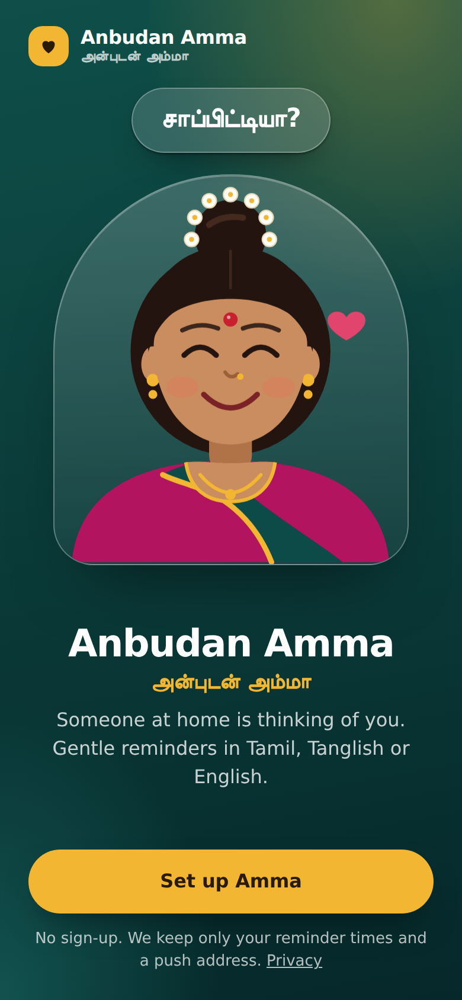
  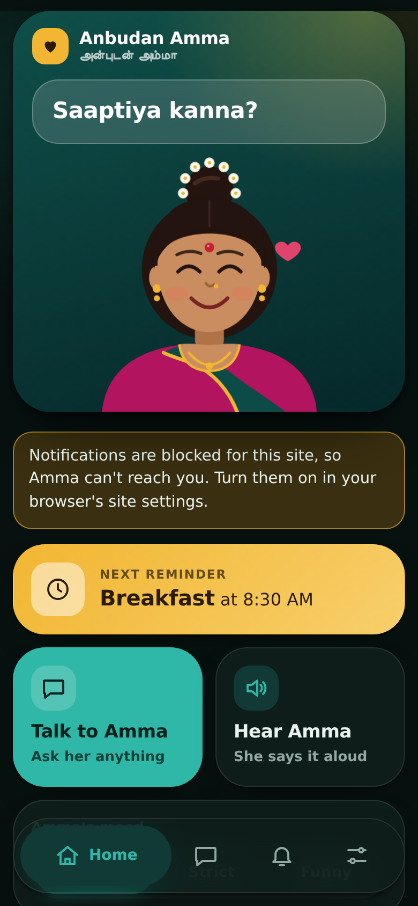
  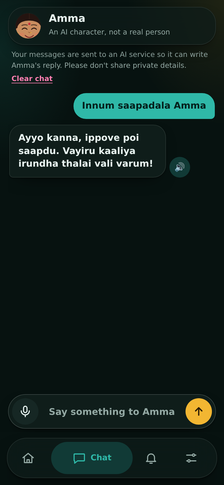
  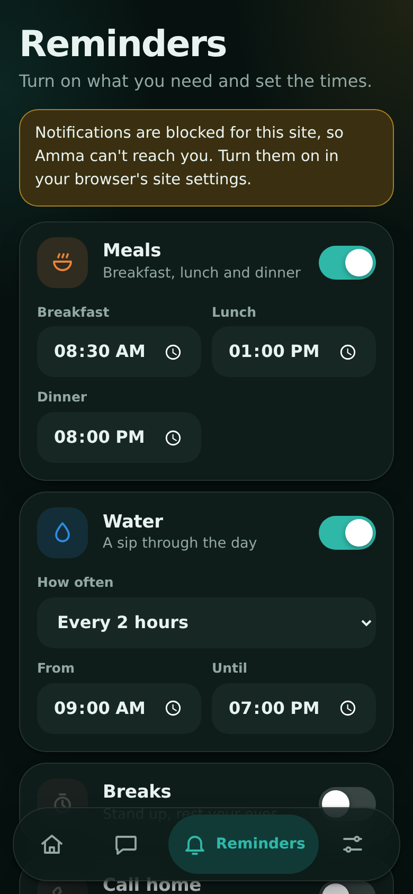
  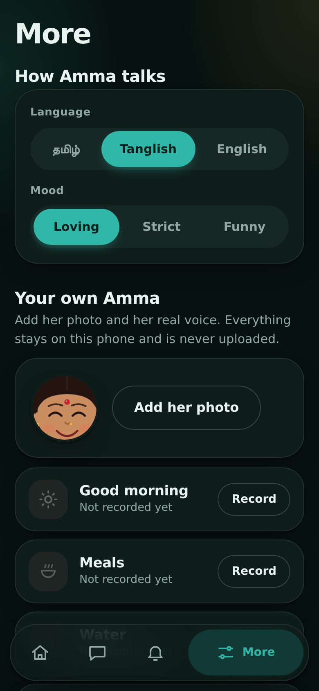
</p>
<p align="center"><sub>Light and dark themes. Screenshots come from a headless test browser with system fonts and a made-up chat line, so on a real phone the text looks a little different.</sub></p>

## Contents
[What it does](#what-it-does) · [Design](#design) · [How it works](#how-it-works) · [Get it running](#get-it-running) · [Android app](#android-app) · [Configuration](#configuration) · [Voice and your own Amma](#voice-and-your-own-amma) · [Chat and AI](#chat-and-ai) · [Project layout](#project-layout) · [Development](#development) · [Privacy and safety](#privacy-and-safety) · [Licence](#licence) · [Troubleshooting](#troubleshooting) · [Roadmap](#roadmap)

## What it does
Anbudan Amma (Tamil: அன்புடன் அம்மா, "with love, Amma") is a progressive web app (PWA). It was first called Ammmaa. You install it on your phone, pick a language and a mood, and Amma sends you the small nudges a mother would: eat, drink water, rest your eyes, call home, go to sleep.

- **Reminders:** meals (breakfast, lunch, dinner), water, breaks, a weekly "call home", bedtime and a good-morning hello. Quiet hours, a daily cap and snooze buttons on the notification keep it caring rather than nagging.
- **Three languages, three moods:** Tamil (தமிழ்), Tanglish (Tamil in English letters) and English; loving, strict or funny. There are 108 hand-written lines (36 per language).
- **A modern phone interface:** a floating tab bar (Home, Chat, Reminders, More), a card-and-tile Home screen, light and dark themes that follow the phone, and smooth motion that respects "reduce motion".
- **A cartoon Amma** who changes her face with the mood (loving, strict, funny, and sleepy at bedtime).
- **Chat with Amma:** a short AI chat in her voice, with a daily limit, a fixed caring reply for serious messages, and a clear "AI character" label.
- **Hear Amma:** pre-made voice clips, or the phone's own voice; a microphone button for speaking in chat.
- **Your own Amma:** add her photo and record her real voice. Both stay on the phone and are never uploaded.
- **No accounts.** The server keeps only your reminder settings and a push address.

## Design
- **Look.** Soft rounded surfaces, glass panels, a bento-style Home and a floating tab bar. Peacock green, haldi gold and silk rose are the brand colours. Type is Manrope for Latin text and Noto Sans Tamil for Tamil, both loaded from Google Fonts.
- **Themes.** Colours are CSS variables in `public/style.css`. The dark theme switches on with the phone's setting.
- **Accessibility.** Text and buttons keep at least 4.5:1 contrast in both themes (a test checks this), tap targets are at least 44 px, reduced-motion is respected, and screen readers get a label on every tab even when only the active label is drawn.
- **Motion.** Tab changes cross-fade using View Transitions where the browser supports them; other browsers switch instantly.
- **Icons.** A small hand-drawn line-icon set in `public/icons.js`, so nothing depends on emoji fonts for the interface.

## How it works
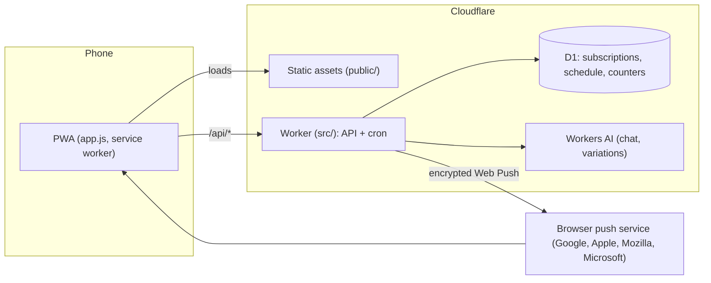
- A **cron trigger runs every minute**. It finds reminders that are due, applies quiet hours and the daily cap, and sends an encrypted Web Push (RFC 8291 with a VAPID signature, using only WebCrypto, so there are no runtime dependencies). A reminder that is more than 10 minutes late is dropped, never queued.
- A **second cron at 21:00 UTC** can write fresh reminder lines with Workers AI (`AI_VARIATIONS`).
- The **service worker** shows the notification, adds "Okay, Amma / Later" buttons (the snooze link is signed with `APP_SECRET`), and opens the app so Amma can say the line out loud.
- The app is a **static site with no build step**: plain ES modules in `public/`.

## Get it running
You need a Cloudflare account, a GitHub account and Node 22 or newer (only to make keys and run tests).

### From a phone (Termux), no Wrangler needed
Wrangler has not installed natively in Termux (it needs native dependencies), so let Cloudflare build from GitHub instead.

1. **Make a push key pair.** In a copy of this repo:
   ```
   node scripts/gen-vapid.mjs
   ```
   Keep both keys. The public key is exactly 87 characters and starts with `B`.
2. **Create the database.** Cloudflare dashboard, Storage & databases, D1: create a database named `ammmaa`, open its Console and run the contents of [`schema.sql`](schema.sql). Copy the database ID.
3. **Edit `wrangler.jsonc`:** set `database_id`, `VAPID_PUBLIC_KEY` and `VAPID_SUBJECT` (a `mailto:` address). Check the key: `grep -Ec '"VAPID_PUBLIC_KEY": "B[A-Za-z0-9_-]{86}"' wrangler.jsonc` must print `1`. The `name` in this file must match the Worker name Cloudflare uses (it takes it from the repository name).
4. **Push to GitHub, then connect it.** Workers & Pages, Create, Import a repository. Every push builds and deploys.
5. **Add two secrets** in the Worker's Settings, Variables and Secrets: `VAPID_PRIVATE_KEY` (from step 1) and `APP_SECRET` (any long random string). Never put these in the repo.
6. **Open the Worker URL on your phone,** finish the setup, allow notifications and tap "Send a test message". On iPhone, use Share, Add to Home Screen first.

### From a computer (Wrangler)
```
npm install
npx wrangler login
npm run db:create        # paste the database_id into wrangler.jsonc
npm run db:init
npm run keys             # paste the public key into wrangler.jsonc
npx wrangler secret put VAPID_PRIVATE_KEY
npx wrangler secret put APP_SECRET
npm run deploy
```

## Android app
The Android app is a Trusted Web Activity: a thin shell that opens the live site with no browser bar. It lives in this same repo as documentation and a small link file, not as a separate project, because the web app stays the only source of truth and web changes reach the Android app immediately. Build it with PWABuilder and link it to the site with `scripts/make-assetlinks.mjs`. The full steps, and what must never be committed (the signing key), are in [`android/README.md`](android/README.md).

## Configuration
Set variables in `wrangler.jsonc` (a value typed in the dashboard is overwritten on the next deploy). Set secrets in the dashboard or with `wrangler secret put`.

| Name | Kind | What it does |
|---|---|---|
| `VAPID_PUBLIC_KEY` | var | Public Web Push key, served to the app |
| `VAPID_SUBJECT` | var | `mailto:` contact for push services |
| `VAPID_PRIVATE_KEY` | secret | Signs push requests |
| `APP_SECRET` | secret | Signs the snooze buttons in notifications |
| `AI_VARIATIONS` | var | `"on"` lets Workers AI write fresh reminder lines (see [Chat and AI](#chat-and-ai)). Default `"off"` |
| `AI_MODEL` | var (optional) | Override the default Workers AI model |
| `CHAT_PROVIDER` | var (optional) | `workers-ai` (default), `groq` or `sarvam`. Workers AI is always the backup |
| `CHAT_DAILY` | var (optional) | Chat messages per phone per day. Default 12 |
| `GROQ_API_KEY`, `GROQ_MODEL` | secret, var | Only for `groq` (default model `llama-3.3-70b-versatile`) |
| `SARVAM_API_KEY`, `SARVAM_MODEL` | secret, var | Only for `sarvam`. The request format is untested against the live service |

Cron triggers are set in `wrangler.jsonc`: `* * * * *` (send reminders) and `0 21 * * *` (write AI lines).

## Voice and your own Amma
**Pre-made clips.** `scripts/make-voice.mjs` makes an MP3 for every ready-made line and writes `public/voice/manifest.json`. It needs the `edge-tts` command (`pip install edge-tts`).
```
node scripts/make-voice.mjs --dry        # plan and character count, makes nothing
node scripts/make-voice.mjs              # safe to re-run: finished clips are skipped
TANGLISH_FROM=ta node scripts/make-voice.mjs --lang=tanglish   # optional: Tamil voice for Tanglish lines
```
Commit `public/voice/`. Without clips, the speaker button uses the phone's own voice, and is hidden if the phone has none. Voices and pace can be changed with `VOICE_TA`, `VOICE_EN`, `RATE` (see the top of the script).
> `edge-tts` is an unofficial client of Microsoft's Edge read-aloud service, and Microsoft publishes nothing about commercial use. Treat these clips as a prototype and replace them with a licensed voice before a public launch.

**Your own Amma** (More tab). A photo (cropped square and shrunk on the phone) and short recordings of her voice for each reminder type. Everything is kept in the browser's storage (IndexedDB and Cache Storage) and never uploaded. When a line is played, her own recording comes first, then the pre-made clip, then the phone's voice. Once she has recorded something, Home only shows lines about the topics she recorded, so Hear Amma plays her real voice. In Chat, a "Her voice" chip plays one of her recordings, and a reply about food, water, sleep, breaks, calls or mornings gets a heart button that plays her recording of that topic (a new AI sentence can never be in her real voice). Tapping Hear on a line with no recording uses the phone's voice and says why. Voice cloning is deliberately not part of this project.

## Chat and AI
- **Chat** (`src/chat.js`, `public/chat.js`). Replies come from the configured provider. Amma is written as a Tamil mother in her early fifties, and her own lines are given to the model as examples of how she talks. There is no trained model: the persona and the examples do the work.
- **Safety net.** Messages that suggest serious distress (English, Tanglish and Tamil keywords) get a fixed, caring reply that mentions India's free Tele-MANAS helpline (14416) and never reach the AI. A keyword list is only a net, so the prompt also tells the model how to respond. Have a native speaker review the Tamil text.
- **Limits and fallback.** After the daily limit, or if every provider fails, Amma answers with one of her ready-made lines.
- **AI variations** (`AI_VARIATIONS=on`). Every night at 21:00 UTC (02:30 IST) Workers AI writes new lines for one language (they rotate). About a third of reminder notifications then use one. Lines must be short (about 8 words), in the right script, and link-free. The in-app preview and the voice clips only use the hand-written lines. To see what was written, run `SELECT lang, tone, kind, text FROM ai_lines` in the D1 console.

## Project layout
```
public/       the PWA: index.html, app.js (screens and tabs), style.css (design tokens, themes), icons.js, sw.js (service worker),
              shared.js (message bank and settings), amma.js (the cartoon), chat.js, voice.js, own.js,
              privacy.html, voice/ (clips), twa/assetlinks.json (Android link file), icons/
src/          the Worker: index.js (API), cron.js (sender), push.js (Web Push), chat.js, ai.js, time.js, auth.js
test/         node:test suites (no network needed)
scripts/      gen-vapid.mjs (push keys), make-voice.mjs (voice clips), make-icons.py (app icons from amma.js),
              make-assetlinks.mjs (writes and checks the Android link file)
docs/         README screenshots
android/      how to build and publish the Android app (no keys, no build output)
schema.sql    D1 schema         wrangler.jsonc    Worker config
LICENSE       MIT               NOTICE.md         what the licence does not cover
```

## Development
```
npm test                        # 53 unit tests, Node 22+, no network
```
- CI runs the same command on every push (`.github/workflows/test.yml`). The suite does not depend on the time of day.
- **After changing anything in `public/`,** bump the `CACHE` name in `public/sw.js`, or installed apps keep showing the old version.
- **The old name lives on inside.** Storage keys such as `ammmaa.v1`, the cache names, the Worker name and the database name still say `ammmaa` on purpose: renaming them would sign people out and lose saved photos, recordings and settings.
- **Icons.** After editing Amma in `public/amma.js`: `pip install playwright && playwright install chromium && python3 scripts/make-icons.py`.
- **Local preview.** Any static server works for the interface (`python3 -m http.server -d public`); push and chat need the Worker.
- **Layout.** Keep new screens free of sideways scrolling at phone widths from 320 to 430 px. The current screens were checked at those widths in a headless browser.

## Privacy and safety
The server keeps: your language, mood, reminder times and time zone; the browser's push address; a hashed private code; and small counters (reminders sent today, failed deliveries, chat messages used today). Chat text is passed to the AI provider to write the reply and is not saved by the server. The last 30 chat messages are kept on the phone until cleared. A photo and recordings never leave the phone. There are no accounts, ads or analytics. The full text is in [`public/privacy.html`](public/privacy.html), and it needs a contact email added before you share the app publicly.

Amma is an AI character. She gives no medical, legal or financial advice, and the app says so.

## Troubleshooting
| Symptom | Likely cause and fix |
|---|---|
| "Failed to execute 'atob'" when turning on notifications | `VAPID_PUBLIC_KEY` is not a clean 87-character key. Regenerate with `scripts/gen-vapid.mjs` and update the public key and the private secret together |
| Build fails with "must have a valid `database_id`" | The placeholder in `wrangler.jsonc` was not replaced |
| Build warns that the Worker name does not match | Set `name` in `wrangler.jsonc` to the Worker name Cloudflare shows |
| The hello notification arrives but nothing else | Open More, tap "Check my reminders". It says whether the every-minute scheduler is running and whether the server has your times. Also check the browser's notification permission and set Chrome's battery use to unrestricted |
| Amma speaks with a robotic phone voice | The voice clips are not deployed. Open `/voice/manifest.json` on your site; a 404 means they were not pushed |
| `wrangler` will not install in Termux | Expected. Use the Git connection route above |

## Roadmap
- [x] Web Push reminders with quiet hours, daily cap and snooze
- [x] Tamil, Tanglish and English; three moods; cartoon Amma
- [x] Chat with a safety net and daily limit
- [x] Voice clips, the phone's voice, and your own Amma (photo and recordings)
- [x] Tabbed mobile layout, modern 2026 interface with light and dark themes
- [x] Renamed to Anbudan Amma; MIT licence
- [ ] "How should Amma call you?" (kanna, da or di)
- [ ] Birthdays, festivals and your own messages
- [ ] A licensed voice for the clips; a native-speaker review of every Tamil line
- [ ] Android app (Trusted Web Activity): the steps and link file are ready in [`android/`](android/README.md); it still has to be built and tested on a phone
- [ ] Play Store listing
- [ ] Optional native features: home-screen widget, alarm-style reminders

## Licence
Released under the [MIT licence](LICENSE), copyright 2026 NBoss. [`NOTICE.md`](NOTICE.md) lists what the licence does not cover: generated voice clips, third-party fonts and AI services, and the name **Anbudan Amma**, which forks should not reuse.

The idea of a caring, Amma-like reminder was inspired by [Maaa](https://www.maaa.app/) on the desktop. This project shares no code or artwork with it.
